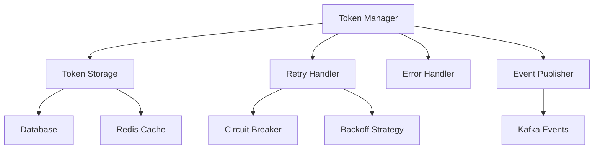
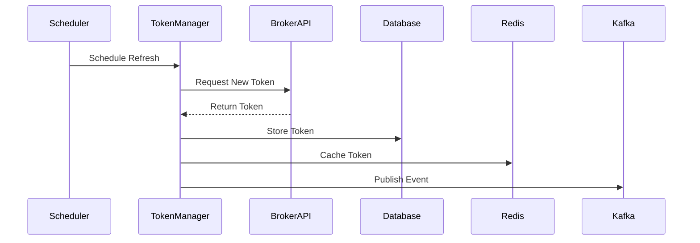
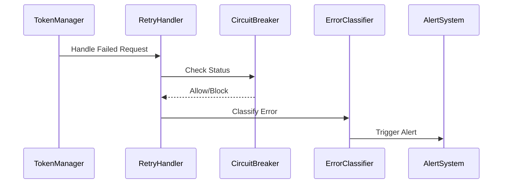

# Architecture Overview

## System Components

### 1. Token Manager (`lib/token/manager.py`)
Core component responsible for token lifecycle management:
- Token refresh scheduling
- Retry mechanisms
- Error handling
- Token storage

### 2. Token Service (`lib/token/service.py`)
Business logic layer that coordinates token operations:
- Token refresh orchestration
- Health monitoring
- Metrics collection
- Background tasks

### 3. API Layer (`api.py`)
FastAPI application providing:
- RESTful endpoints
- WebSocket updates
- Admin interface
- Health checks
- Metrics endpoints

## Data Flow

### Token Refresh Flow

### Error Handling Flow

## Key Design Patterns

1. **Circuit Breaker Pattern**
   - Prevents system overload
   - Handles broker API failures gracefully
   - Configurable thresholds

2. **Repository Pattern**
   - Abstracts token storage
   - Supports multiple storage backends
   - Transaction management

3. **Publisher/Subscriber Pattern**
   - Event-driven architecture
   - Kafka integration
   - Async event processing

4. **Strategy Pattern**
   - Pluggable retry strategies
   - Configurable error handling
   - Extensible monitoring

## Security Architecture

### Token Storage
- AES-256 encryption at rest
- Key rotation support
- Secure configuration

### API Security
- JWT authentication
- Rate limiting
- CORS protection
- Role-based access

## Scalability

### Horizontal Scaling
- Redis-based distributed locking
- Multi-instance support
- Load balancing ready

### High Availability
- Automated failover
- Redundant storage
- No single point of failure

## Integration Points

1. **Broker APIs**
   - Zerodha Kite Connect
   - Other broker integrations

2. **Infrastructure**
   - Redis for caching
   - Kafka for events
   - PostgreSQL for storage

3. **Monitoring**
   - Prometheus metrics
   - Grafana dashboards
   - Alert manager

## Configuration Management

### Environment Variables
- Broker API keys
- Security settings
- Feature flags

### Configuration Files
- Broker settings
- Logging config
- Monitoring setup

## Future Considerations

1. **Planned Improvements**
   - GraphQL API support
   - WebSocket subscriptions
   - Enhanced monitoring

2. **Scalability Enhancements**
   - Kubernetes operators
   - Service mesh integration
   - Cloud native features

3. **Security Additions**
   - mTLS support
   - Enhanced encryption
   - Audit logging